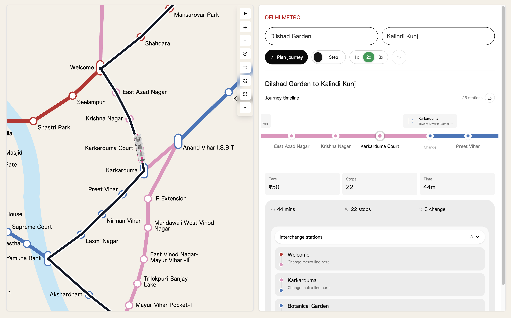

# Delhi Metro Route Planner


Interactive Delhi Metro route planning with station search, fare and time estimates, animated map playback, journey timelines, and PNG/MP4 exports.



## Features

- Search Delhi Metro origin and destination stations.
- View route fare, stop count, estimated travel time, interchanges, and line direction.
- Follow the metro on the SVG map with smooth or station-by-station animation.
- Choose route camera zoom levels for map playback and video export.
- Export the journey timeline as PNG.
- Export the animated metro route as MP4 using Mediabunny.

## Tech Stack

- React 19
- TypeScript
- Vite
- Tailwind CSS
- GSAP
- Zustand
- Mediabunny
- html-to-image

## Getting Started

```bash
pnpm install
pnpm run dev
```

Build for production:

```bash
pnpm run build
```

Preview the production build:

```bash
pnpm run preview
```
